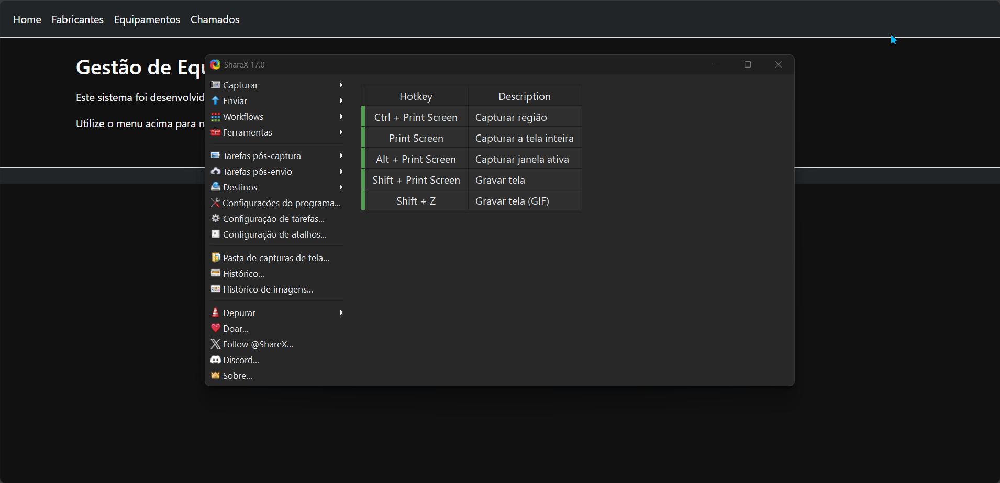

# 💻 Academia do Programador - Sistema de Gestão de Equipamentos

Este é um projeto de aplicação **console em C#**, desenvolvido como parte da atividade prática da **Academia do Programador**. O sistema tem como objetivo simular o controle de **equipamentos**, **chamados de manutenção** e **fabricantes**, utilizando os conceitos fundamentais da **programação orientada a objetos (POO)**.

---

## 📚 Objetivo da Atividade

O personagem Junior cuida do estoque de equipamentos em sua empresa e precisa de um sistema simples que substitua suas planilhas do Excel. O software foi criado para **automatizar as tarefas rotineiras**, como cadastros, edições e exclusões de equipamentos, fabricantes e chamados de manutenção.

---

## 🧩 Funcionalidades Implementadas

### ✅ Módulo de Equipamentos
- Cadastro de equipamentos com:
  - Nome (mín. 2 caracteres)
  - Preço de aquisição (maior que zero)
  - Número de série
  - Data de fabricação
  - Fabricante vinculado
- Listagem completa de todos os equipamentos
- Edição e exclusão de equipamentos cadastrados
- Validação e tratamento de exceções nas entradas

### ✅ Módulo de Chamados
- Registro de chamados de manutenção, vinculando ao equipamento
- Visualização de chamados com:
  - Equipamento relacionado
  - Data de abertura
  - Quantidade de dias em aberto
- Edição e exclusão de chamados
- Validação de dados e escolha segura de equipamento por ID

### ✅ Módulo de Fabricantes
- Cadastro de fabricantes com:
  - Nome (mín. 2 caracteres)
  - Email válido
  - Telefone obrigatório
- Listagem dos fabricantes com:
  - Quantidade de equipamentos cadastrados por fabricante
- Edição e exclusão de fabricantes
- Verificações de entrada com mensagens de erro personalizadas

---

## 🧠 Pilares de POO Utilizados

- **Encapsulamento**: todos os atributos estão protegidos com propriedades validadas.
- **Herança**: todas as entidades (`Fabricante`, `Equipamento`, `Chamado`) herdam de uma superclasse `EntidadeBase`.
- **Polimorfismo**: método `ExibirInformacoes()` é sobrescrito em cada entidade.
- **Abstração**: uso da interface `IRepositorio<T>` para padronizar a lógica de dados.

---

## 🏗️ Estrutura do Projeto

O projeto foi organizado em **módulos separados por pasta**, com aplicação dos princípios de orientação a objetos para facilitar manutenção e legibilidade.

```
Academia_Programador_GestaoEquipamentosFabricantes/
│
├── Program.cs # Menu principal
│
├── Compartilhado/
│ ├── EntidadeBase.cs
│ └── IRepositorio.cs
│
├── ModuloEquipamento/
│ ├── Equipamento.cs
│ ├── RepositorioEquipamentos.cs
│ └── TelaEquipamento.cs
│
├── ModuloChamado/
│ ├── Chamado.cs
│ ├── RepositorioChamado.cs
│ └── TelaChamado.cs
│
├── ModuloFabricante/
│ ├── Fabricante.cs
│ ├── RepositorioFabricante.cs
│ └── TelaFabricante.cs
```

---

## 🚀 Tecnologias Utilizadas

- `C#` (.NET 6 ou superior)
- `Console Application`
- `Programação Orientada a Objetos`
- `List<T>` para simulação de banco de dados em memória
- `Visual Studio 2022` ou superior

---

## 🏁 Como Executar o Projeto

1. Abra o Visual Studio.
2. Execute o projeto como **Aplicação de Console (.NET)**.
3. Use as opções do menu principal para navegar entre os módulos.

---

## 👨‍🏫 Atividade Acadêmica

Este projeto foi desenvolvido como parte das atividades da **Academia do Programador**, com foco em lógica de programação, estrutura modular, tratamento de exceções e aplicação prática dos pilares da POO em um sistema realista.

---

## 📌 Observações

- Nenhum banco de dados é utilizado: os dados são armazenados temporariamente em listas.
- Ideal para estudantes que estão aprendendo os fundamentos da programação orientada a objetos em C#.


---


